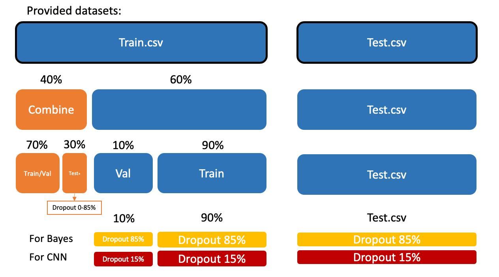

# Project_in_DataScience_Bayesian_DeepNeuralNetwork

## Dataset for CNN_version_2

The dataset used in the notebook **CNN_version2.ipynb** is **not included in this repository** since GitHub does not allow files larger than 100 MB.

Instead get the dataset from this repository:  
👉 [guilhermedom / cnn-fashion-mnist](https://github.com/guilhermedom/cnn-fashion-mnist) 

After downloading, place the data under a file called data_copy. 

### Dataset Splitting & Model Training Pipeline

The following diagram illustrates how the dataset is divided and how the models are trained, validated, and tested:

- Training dataset is split into two parts:  
  - 60% is used for training individual models (CNN and Bayes)
    - Each of these subsets is further split into 90% training and 10% validation 
    - CNN is trained with 85% dropout rate, while Bayes is trained with 15% dropout.  
  - 40% is used for training the combined model, with 70% for training/validation and 30% for testing (the test set includes various levels of degradation).  
👉 Find the code for the split here: [split.ipynb](./split.ipynb)
- Test dataset (provided separately) is used for final evaluation of all models.
